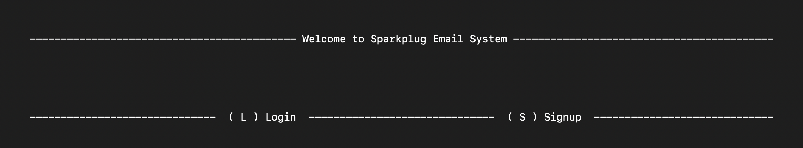
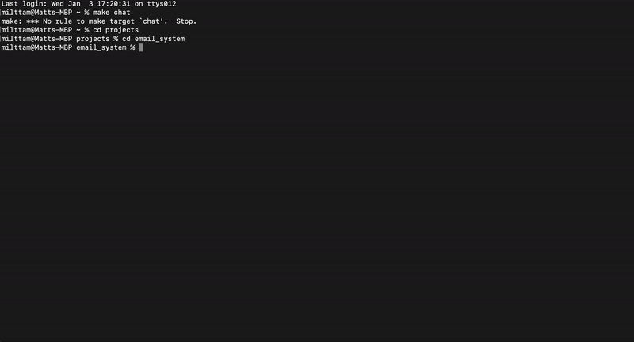

# Sparkplug Email System



## Description

This project is a locally deployed email system where multiple users can interact on a command-line interface.

This project was implemented from scratch using <mark>vanilla OCaml</mark> for the CLI and server-side code, and uses JSON files for local storage.

The biggest challenge in completion of this project was designing the server-side code to handle multiple users and their respective inboxes. Since we did not use any additional libraries, we had to implement our own data structures and according modules to handle this.

There are no visible commits in this repository due to the fact that we used a private repository for development, and then pushed the final version to this public repository. Some revisions/edits may be made in the future.

## Getting Started and Usage

### Prerequisites (Mac)

- ocaml/opam (https://cs3110.github.io/textbook/chapters/preface/install.html or https://ocaml.org/docs/installing-ocaml)

```
brew install opam
```

### Installation

1. Clone the repo in the desired directory

```
git clone https://github.com/Milttam/email-system.git
```

2. Enter the directory
3. Download Core library

```
opam install core
```

4. Compile the code

```
make build
```

5. Run the system

```
make chat
```

### Features

- Register/Login
- Send Message
- Check Inbox/Outbox

Example Usage:\


### Contributors

Chris Johnson (crj36) <br />
Matt Lim (sl2533) <br />
Sarah Feng (sf527) <br />
Andre Foster (agf56)
